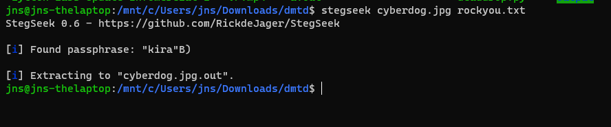
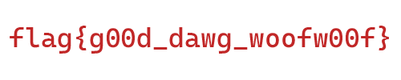

## Cyberdog
_steganography_
_flag{secret_message}_

[image](cyberdog.jpg)

Ở đây tác giả giấu một thông điệp trong bức ảnh. Mình sử dụng tool [Stegseek](https://github.com/RickdeJager/stegseek) để tìm kiếm thông điệp đó.

Mình sử dụng wordlist là [rockyou.txt](https://github.com/brannondorsey/naive-hashcat/releases/download/data/rockyou.txt) để bruteforce tìm ra passphrase của bức ảnh .

Mình đổi tên file `cyberdog.jpg.out` thành `cyberdog.jpg` và mở file sau đó mình tìm thấy flag:

