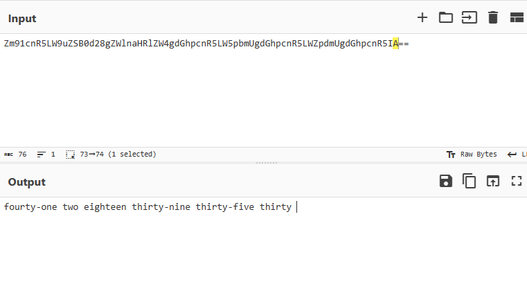

## Dead drop
_programming_

```python
# Password recovery:
#buA9kvZ=T_A}b[J8l:@ob_tviPZtb_<olOpxkvZ=T_=xju]olOpxkvZ=T_bxlu]olOpxkvZ=QIEE
arr = ['empty', 'interest', 'current', 'valuable', 'influence', 'from', 'scolded', 'would', 'got', 'key', 'facility', 'run', 'great', 'tack', 'scent', 'close', 'are', 'a', 'plan', 'counter', 'earth', 'self', 'we', 'sick', 'return', 'admit', 'bear', 'cache', 'to', 'grab', 'domination', 'feedback', 'especially', 'motivate', 'tool', 'world', 'phase', 'semblance', 'tone', 'is', 'will', 'the', 'can', 'global', 'tell', 'box', 'alarm', 'life', 'necessary']
def print_password(nums):
    if len(nums) < 1:
        print("Must provide a list of at least one number i.e. [1]")
    print("flag{{{}}}".format(" ".join([arr[num] for num in nums])))

def left_shift(s, n):
    return ''.join(chr(ord(char) - n) for char in s)

```

Ở đây mình thấy hàm `left_shift` có tác dụng dịch chuyển các kí tự của chuỗi `s` đi `n` kí tự. 
Mình nhận thấy chuỗi `buA9kvZ=T_A}b[J8l:@ob_tviPZtb_<olOpxkvZ=T_=xju]olOpxkvZ=T_bxlu]olOpxkvZ=QIEE` có chứa các dấu `=`, ở cuối chuỗi có 2 chữ `E` nên mình thử dịch chuỗi này đi `ord(E)-ord(=)` kí tự, mục đích là biến chuỗi trên thành một chuỗi base64 hợp lệ. 

```python
passwd = "buA9kvZ=T_A}b[J8l:@ob_tviPZtb_<olOpxkvZ=T_=xju]olOpxkvZ=T_bxlu]olOpxkvZ=QIEE"
print(left_shift(passwd, ord('E')-ord('=')))
```
> Zm91cnR5LW9uZSB0d28gZWlnaHRlZW4gdGhpcnR5LW5pbmUgdGhpcnR5LWZpdmUgdGhpcnR5IA==

Kết quả đúng như mình nghĩ, đó là một chuỗi base-64, mình sử dụng web cyberchef.org để decode chuỗi này.


Kết quả decode ra một chuỗi gồm cách đọc tiếng anh của một vài số, mình sử dụng hàm `print_password` để in ra flag.

```python
print_password([41, 2, 18, 39, 35, 30])
```
> flag{the current plan is world domination}
